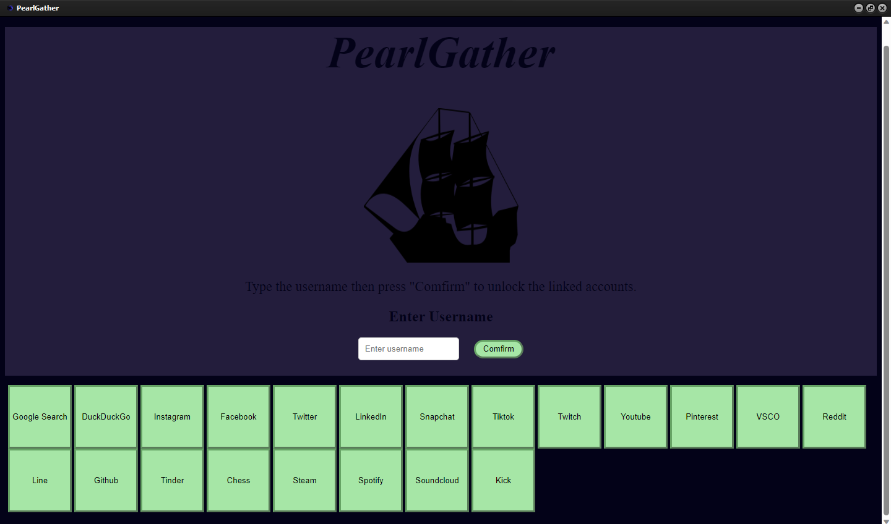

# PearlGather: A Software Application For Social Networking
Crafted with HTML and DecSoft HTML Compiler, this sophisticated software facilitates seamless social networking. Users input a username, and the application enables comprehensive searches across various platforms like Google, Facebook, Instagram, TikTok, and more, using dedicated buttons. Upon confirmation, the entered username is securely captured, and specialized functions are employed to effortlessly open profiles on different platforms, enhancing user convenience. Each platform button initiates a new tab/window, streamlining the search process for users. Additionally, dedicated buttons for Google and DuckDuckGo searches with the entered username further enhance the application's versatility and user experience.

